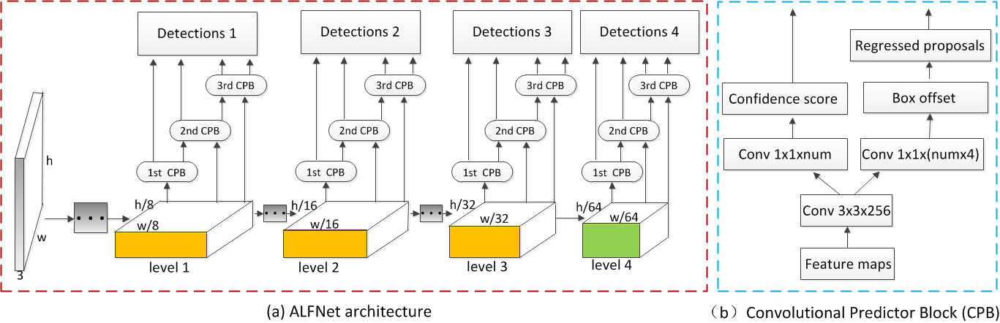

# Learning Efficient Single-stage Pedestrian Detectors by Asymptotic Localization Fitting
This is the Keras implementation of our paper accepted in ECCV 2018.
## Introduction
This paper is a step forward pedestrian detection for both speed and accuracy. Specifically, a structurally simple but effective module called Asymptotic Localization Fitting (ALF) is proposed, which stacks a series of predictors to directly evolve the default anchor boxes step by step into improving detection results. As a result, during training the latter predictors enjoy more and better-quality positive samples, meanwhile harder negatives could be mined with increasing IoU thresholds. On top of this, an efficient single-stage pedestrian detection architecture (denoted as ALFNet) is designed, achieving state-of-the-art performance on CityPersons and Caltech. For more details, please refer to our [paper]

 

### Dependencies

* Python 2.7
* Numpy
* Tensorflow 1.x
* Keras 2.0.6
* OpenCV

## Contents
1. [Installation](#installation)
2. [Preparation](#preparation)
3. [Models](#models)
4. [Training](#training)
5. [Test](#test)
6. [Evaluation](#evaluation)

### Installation
1. Get the code. We will call the cloned directory as '$ALFNet'.
```
  git clone https://github.com/liuwei16/ALFNet.git
```
2. Install the requirments.
```
  pip install -r requirements.txt
```

### Preparation
1. Download the dataset.
We trained and tested our model on the recent [CityPersons](https://bitbucket.org/shanshanzhang/citypersons) pedestrian detection dataset, you should firstly download the datasets. By default, we assume the dataset is stored in '$ALFNet/data/cityperson/'.

2. Dataset preparation.
We have provided the cache files of training and validation subsets. Optionally, you can also follow the [./generate_data.py](https://github.com/liuwei16/ALFNet/blob/master/generate_data.py) to create the cache files for training and validation. By default, we assume the cache files is stored in '$ALFNet/data/cache/cityperson/'.

3. Download the initialized models.
We use the backbone [ResNet-50](https://github.com/fchollet/deep-learning-models/releases/download/v0.2/resnet50_weights_tf_dim_ordering_tf_kernels.h5) and [MobileNet_v1](https://github.com/fchollet/deep-learning-models/releases/download/v0.6/) in our experiments. By default, we assume the weight files is stored in '$ALFNet/data/models/'.

### Models
We have provided the models that are trained on the training subset with different ALF steps and backbone architectures. To help reproduce the results in our paper,
1. For ResNet-50:

  ALFNet-1s: [city_res50_1step.hdf5](https://pan.baidu.com/s/1WPo6dUfMchV_EECmG_VZgw)
  
  ALFNet-2s: [city_res50_2step.hdf5](https://pan.baidu.com/s/1WPo6dUfMchV_EECmG_VZgw)
  
  ALFNet-3s: [city_res50_3step.hdf5](https://pan.baidu.com/s/1WPo6dUfMchV_EECmG_VZgw)
 
 
2. For MobileNet: 

 MobNet-1s: [city_mobnet_1step.hdf5](https://pan.baidu.com/s/1WPo6dUfMchV_EECmG_VZgw)
 
 MobNet-2s: [city_mobnet_2step.hdf5](https://pan.baidu.com/s/1WPo6dUfMchV_EECmG_VZgw)

### Training
Optionally, you should set the training parameters in [./keras_alfnet/config.py](https://github.com/liuwei16/ALFNet/blob/master/keras_alfnet/config.py).

1. Train with different backbone networks.

 Follow the [./train.py](https://github.com/liuwei16/ALFNet/blob/master/train.py) to start training. You can modify the parameter 'self.network' in [./keras_alfnet/config.py](https://github.com/liuwei16/ALFNet/blob/master/keras_alfnet/config.py) for different backbone networks. By default, the output weight files will be saved in '$ALFNet/output/valmodels/(network)/'.

2. Train with different ALF steps.
 
 Follow the [./train.py](https://github.com/liuwei16/ALFNet/blob/master/train.py) to start training. You can modify the parameter 'self.steps' in [./keras_alfnet/config.py](https://github.com/liuwei16/ALFNet/blob/master/keras_alfnet/config.py) for different ALF steps. By default, the output weight files will be saved in '$ALFNet/output/valmodels/(network)/(num of)steps'.

### Test
Follow the [./test.py](https://github.com/liuwei16/ALFNet/blob/master/test.py) to get the detection results. By default, the output .txt files will be saved in '$ALFNet/output/valresults/(network)/(num of)steps'.

### Evaluation
1. Follow the [./evaluation/dt_txt2json.m](https://github.com/liuwei16/ALFNet/blob/master/evaluation/dt_txt2json.m) to convert the '.txt' files to '.json'.
2. Follow the [./evaluation/eval_script/eval_demo.py](https://github.com/liuwei16/ALFNet/blob/master/evaluation/eval_script/eval_demo.py) to get the Miss Rate (MR) results of models. By default, the models are evaluated based on the Reasonable settting. Optionally, you can modify the parameters in [./evaluation/eval_script/eval_MR_multisetup.py](https://github.com/liuwei16/ALFNet/blob/master/evaluation/eval_script/eval_MR_multisetup.py) to evaluate the models in different settings, such as different occlusion levels and IoU thresholds.

## Citation
If you think our work is useful in your research, please consider citing:
```
@inproceedings{liu2018learning,
  title={Learning Efficient Single-stage Pedestrian Detectors by Asymptotic Localization Fitting},
  author={Wei Liu, Shengcai Liao, Weidong Hu, Xuezhi Liang, Xiao Chen},
  booktitle={European Conference on Computer Vision (ECCV)},
  year={2018}
}
```


